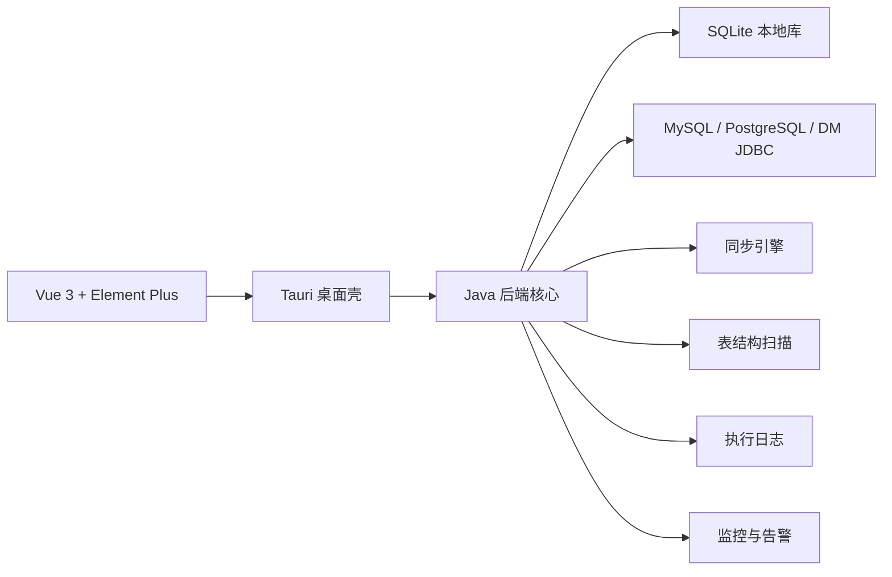

# DB Sync Studio

DB Sync Studio 是一个跨平台数据库同步桌面应用，面向 `macOS`、`Windows` 和 `Linux`。

当前仓库已经实现了一套可运行、可打包、可安装的桌面应用原型：
- 用户下载安装到后即可直接打开
- 不需要手动安装 Java、Node、数据库客户端
- 桌面壳使用 `Tauri + Vue 3 + Element Plus`
- 同步核心使用 `Java`
- 本地持久化使用 `SQLite`
- 打包产物内置 JRE，面向安装即用体验

## 仓库结构

- `app-model`：共享模型、枚举、仓储接口
- `app-store`：SQLite 初始化、迁移、仓储实现
- `app-core`：Java 核心、后端 HTTP API、同步引擎、校验/修复/调度、监控与告警编排
- `app-ui`：Vue 3 + Element Plus 前端
- `app-shell`：Tauri 桌面壳
- `scripts`：统一打包入口、图标生成和发布辅助脚本

## 目标

DB Sync Studio 的目标是提供一个本地化的数据库同步工作台，用于：
- 管理数据源
- 扫描表结构
- 创建同步任务
- 配置字段映射
- 执行全量同步和增量同步
- 查看执行日志、断点状态、监控与告警
- 输出可直接分发的桌面安装包

## 技术栈

- 前端：Vue 3 + Element Plus
- 桌面框架：Tauri
- 后端核心：Java
- 本地数据库：SQLite
- 同步引擎：Java 实现
- 打包方式：内置 JRE 的独立安装包或可执行文件

## 当前功能

### 已实现

- 桌面壳与首页
- 数据源管理
  - MySQL
  - PostgreSQL
  - 达梦 DM
  - 保存连接配置
  - 测试连接
- SQLite 本地存储
  - 数据源配置
  - 同步任务
  - 字段映射
  - 执行日志
  - 同步运行记录
  - 断点信息
  - 监控指标
  - 告警规则、渠道、历史、去重状态
- 表结构扫描
  - schema
  - table
  - columns
  - primary key
- 同步任务管理
  - 全量同步
  - 增量同步
  - 手动执行
  - 开始 / 暂停 / 恢复 / 停止
  - 批量表执行
- 字段映射
  - 源字段到目标字段映射
  - 忽略字段
  - 默认值
  - 转换规则
  - 自动推荐
- 数据预览
  - 按表分页查看数据
  - 支持过滤和排序
- SQL 编辑器
  - 执行查询和增删改语句
  - 结果表格和执行日志回写
- 创建向导
  - 源 / 目标数据源选择
  - schema / table 选择
  - 自动生成字段映射
- 校验与修复
  - 数据校验
  - 数据修复
- 同步引擎
  - 分页读取
  - 批量写入
  - 断点续传
  - 失败重试
  - 进度实时更新
  - 执行日志
- 监控与告警
  - 运行监控概览
  - 趋势数据
  - 任务执行统计
  - 数据库连接状态
  - 告警规则和渠道配置
  - 告警历史查询
- 桌面页面
  - 首页仪表盘
  - 数据源管理
  - 元数据扫描
  - 同步任务
  - 数据预览
  - SQL 编辑器
  - 创建向导
  - 字段映射
  - 执行日志
  - 结构比较
  - 调度中心
  - 数据校验
  - 运行监控
  - 告警设置
  - 告警历史
  - 任务运行详情
- 打包发布
  - macOS：`.dmg`
  - Windows：`.exe` / `.msi`
  - Linux：`.AppImage` / `.deb`

### 仍在持续完善

- 更智能的字段映射生成
- 更完整的增量规则配置
- 更细化的日志筛选与审计
- 更丰富的任务调度能力

## 架构概览



## 主要目录

```text
DB-Sync-Studio/
├── app-model/         # 共享模型、枚举、仓储接口
├── app-store/         # SQLite 持久化实现
├── app-core/          # Java 核心、连接、扫描、同步、后端 API
├── app-ui/            # Vue 3 + Element Plus 前端
├── app-shell/         # Tauri 桌面壳
├── scripts/           # 构建、打包、图标生成脚本
└── release/           # 发布产物输出目录
```

## 目录说明

- `app-model`：数据源、任务、字段映射、日志、监控、告警、元数据的共享模型
- `app-store`：SQLite 初始化、迁移与仓储实现
- `app-core`：连接测试、元数据扫描、同步引擎、校验修复、调度、桌面后端 HTTP API
- `app-ui`：桌面页面、路由、布局、API 调用
- `app-shell`：Tauri 壳工程，负责拉起 Java 后端进程
- `scripts`：统一打包入口，输出独立安装包

## 环境要求

### 必需

- Node.js 18+
- npm
- Maven 3.8+
- Java 17
- Rust 工具链 `cargo` / `rustup`

### 推荐

- 安装完整 JDK 17，并把 `JAVA_HOME` 指向 JDK 17
- 打包 macOS 时确保 `cargo tauri` 可用

## 本地开发

### 1. 安装前端依赖

```bash
npm --prefix app-ui install
```

### 2. 运行 Java 测试

```bash
mvn test
```

### 3. 启动前端开发环境

```bash
npm --prefix app-ui run dev
```

### 4. 启动桌面壳开发模式

```bash
npm --prefix app-shell run tauri:dev
```

### 5. 构建前端

```bash
npm --prefix app-ui run build
```

## 打包发布

推荐使用仓库提供的统一打包脚本。

### macOS

```bash
./scripts/package.sh macos
```

### Linux

```bash
./scripts/package.sh linux
```

### Windows PowerShell

```powershell
.\scripts\package.ps1 windows
```

### Windows CMD

```bat
scripts\package.bat
```

## 发布产物

打包后会输出到：

- `release/macos/`
- `release/windows/`
- `release/linux/`

macOS 的 Tauri bundle 会复制到：

- `release/macos/tauri-bundle/dmg/`

## 安装与使用

### macOS

1. 双击 `.dmg`
2. 将 `DB Sync Studio.app` 拖到 `Applications`
3. 从应用程序中启动

### Windows

1. 运行 `.exe` 或安装 `.msi`
2. 从开始菜单或桌面快捷方式启动

### Linux

1. 运行 `.AppImage` 或安装 `.deb`
2. 从系统菜单启动

用户侧不需要额外安装 Java。

## 运行说明

- 前端通过 Tauri 调用本地后端
- 后端默认监听本机端口
- SQLite 文件与运行时数据由后端统一管理
- 监控与告警数据保存在本地 SQLite
